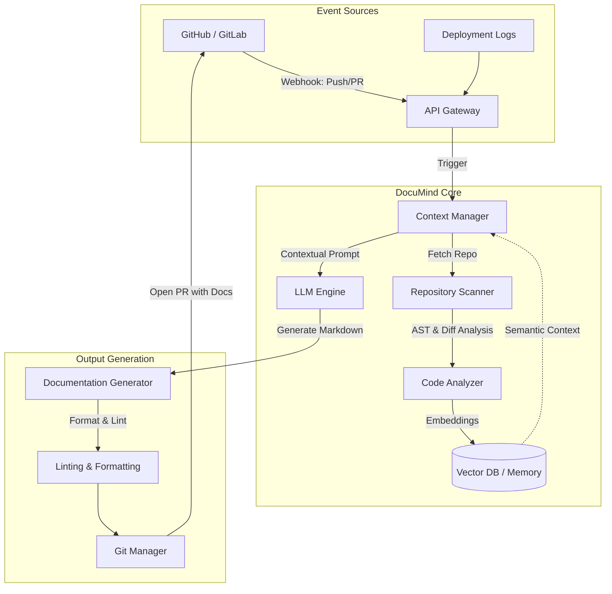

# Architecture Overview: DocuMind AI

This document details the system architecture of **DocuMind AI**, an autonomous technical documentation agent that continuously analyzes repositories and synchronizes documentation.

## System Overview

DocuMind AI is designed as an agentic system that monitors codebases, understands deep architectural context through semantic search and AST parsing, and automatically generates or updates documentation to match the current state of the codebase.

### High-Level Architecture Diagram

## Component Relationships

### 1. Repository Scanner (`scanner.py`)
- **Responsibility**: Recursively walks through project directories, parsing files to extract folder structure, functions, classes, and environment variables. It identifies newly added code, modified logic, and deleted components.

### 2. Context Manager & Memory (`memory.py`)
- **Responsibility**: Manages the historical state of the repository. It stores embeddings of the codebase in a Vector Database to enable "Semantic Code Search" and "Repository Q&A". This ensures the LLM has deep contextual awareness of the entire project, not just the files that changed.

### 3. LLM Engine & Generator (`generator.py`)
- **Responsibility**: The core reasoning engine. It takes the diffs, the structural context, and the project memory, and uses a large language model to reason about the changes. It generates structured markdown for `README.md`, `API_SPECS.md`, `ARCHITECTURE.md`, and changelogs.

### 4. Git Manager (`git_manager.py`)
- **Responsibility**: Handles all Git operations. Instead of pushing directly to `main`, it intelligently creates branches, commits the generated documentation, and opens pull requests with detailed summaries of what documentation was updated and why.

## Data Flow

1. **Trigger**: A developer pushes code or opens a PR. A webhook triggers DocuMind.
2. **Analysis**: DocuMind fetches the diff and parses the affected files.
3. **Retrieval**: The Context Manager retrieves relevant past documentation and architectural context from the Vector DB.
4. **Generation**: The LLM Engine is prompted to generate updated documentation segments, replacing stale sections while preserving unchanged developer intent.
5. **Delivery**: The Git Manager commits the updated markdown files and pushes them back to the repository.
