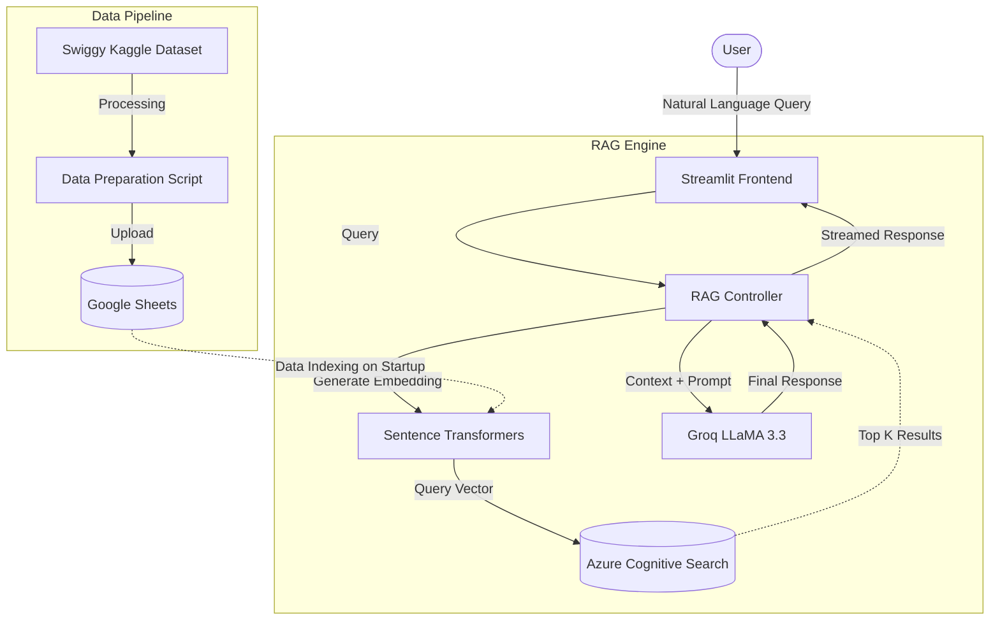

# Architecture Overview: India Restaurant Finder

This document details the system architecture of the **India Restaurant Finder**, a conversational Retrieval-Augmented Generation (RAG) application.

## System Overview

The system is designed to provide AI-powered, context-aware restaurant recommendations based on a dataset of restaurants across major Indian cities. It utilizes a **RAG (Retrieval-Augmented Generation)** architecture to ensure responses are grounded in factual, up-to-date data rather than relying solely on the LLM's pre-trained knowledge.

### High-Level Architecture Diagram

## Component Relationships

### 1. Frontend Interface (`app.py`)
- **Technology**: Streamlit
- **Responsibility**: Manages the user session, displays the chat interface, and presents example queries. It maintains chat history in the session state and uses a cached resource decorator to prevent reloading the RAG engine on every interaction.

### 2. Data Ingestion & Storage
- **`prepare_data.py`**: Cleans and filters the raw `swiggy_file.csv` dataset, standardizes columns (City, Name, Category, Area, Rating, Price), and pushes the cleaned data to Google Sheets via the `gspread` library.
- **Google Sheets**: Acts as the live data source for the application.

### 3. Vector Search & Indexing (`setup_azure_index.py`)
- **Technology**: Azure Cognitive Search
- **Schema**: Defines a custom index (`india-services-index`) incorporating standard metadata fields (name, city, rating, etc.) and a 384-dimensional vector field (`contentVector`).
- **Vector Algorithm**: Uses Hierarchical Navigable Small World (HNSW) for approximate nearest neighbor search.

### 4. RAG Engine & LLM (`rag_engine.py`)
- **Embeddings**: Uses `sentence-transformers/all-MiniLM-L6-v2` to convert text into 384-dimensional vectors locally.
- **Retrieval**: Performs a hybrid search (keyword + vector) against the Azure Cognitive Search index.
- **Generation**: Passes the retrieved context and user query to Groq's inference engine running the `llama-3.3-70b-versatile` model.

## Data Flow

1. **Initialization**: When the Streamlit app starts, `init_rag()` is called. This connects to Google Sheets, fetches all records, generates embeddings for each row, and uploads these documents to Azure Cognitive Search.
2. **Querying**: The user submits a query.
3. **Retrieval**: The query is vectorized. Azure Search returns the top 5 nearest neighbors based on vector similarity and keyword matching.
4. **Synthesis**: The context from the top 5 results is bundled with a system prompt and sent to Groq.
5. **Response**: Groq returns a conversational, contextually accurate response.

## External Integrations

| Integration | Purpose | Authentication |
|-------------|---------|----------------|
| **Groq API** | High-speed LLM inference | API Key (`GROQ_API_KEY`) |
| **Azure Cognitive Search** | Vector Database | Endpoint & Admin Key (`AZURE_SEARCH_KEY`) |
| **Google Sheets API** | Live Data Storage | Service Account JSON (`GOOGLE_CREDENTIALS_PATH`) |

## Deployment Notes
- Since indexing occurs on initialization (`_load_and_index_data`), cold starts can take a minute while embeddings are generated for the dataset and uploaded to Azure.
- The application relies heavily on `.env` variables. Ensure they are configured before deployment.
